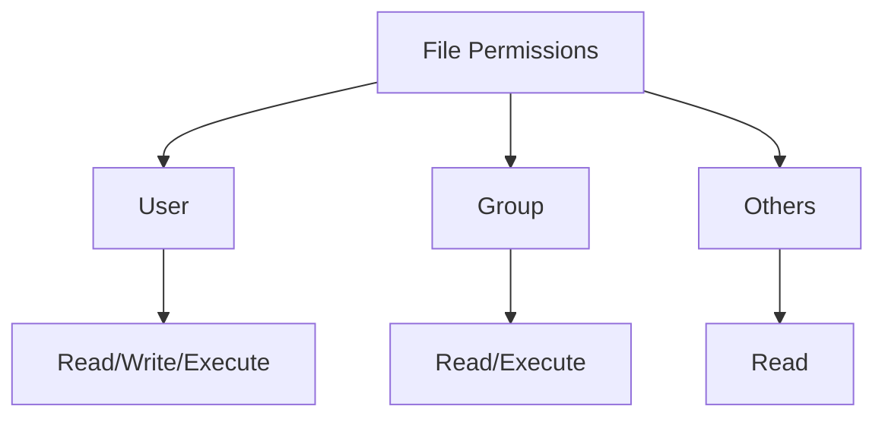
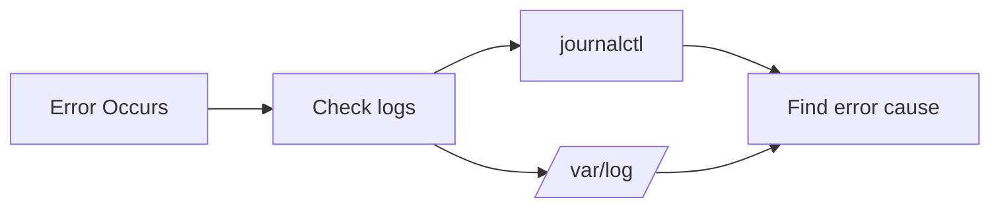
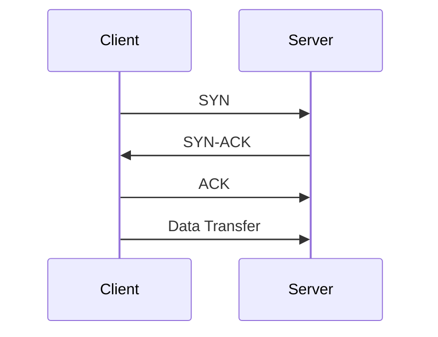
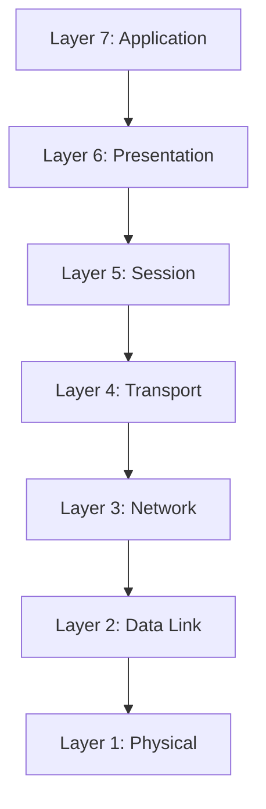
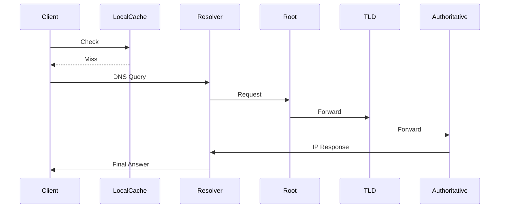
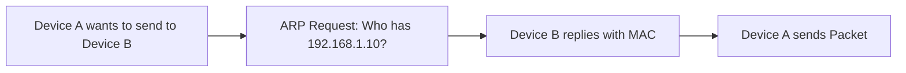

# 📘 Day 1 — Linux & Networking Core Notes

---

# 📑 **Contents**
- <a href="#linux-basics">Linux Basics</a>
- <a href="#linux-file-permissions">Linux File Permissions</a>
- <a href="#system-services">System Services & Systemctl</a>
- <a href="#process-management">Process Management</a>
- <a href="#logs">System Logs & Journalctl</a>
- <a href="#linux-networking">Linux Networking Tools</a>
- <a href="#tcp-ip">TCP/IP Deep Dive</a>
- <a href="#osi-model">OSI Model Diagram & Explanation</a>
- <a href="#dns-resolution">DNS Resolution Flow</a>
- <a href="#routing-basics">Routing Basics (Linux + Theory)</a>
- <a href="#icmp-arp">ICMP & ARP</a>
- <a href="#interview-questions">Interview Questions (Day 1)</a>

---

# <a id="linux-basics"></a>🧩 **Linux Basics**

Linux is the core OS for all DevOps, Cloud, SRE, and Networking roles. These commands are frequently asked in interviews.

### 🔹 Common Commands
```
ls -la           # list files with permissions
pwd              # print current directory
cd /path         # change directory
cp file1 file2   # copy files
mv file1 file2   # move/rename
rm -rf dir       # remove directory
cat /etc/os-release   # check OS info
```

### 🔹 System Information
```
uname -a          # kernel info
hostnamectl       # hostname + OS
uptime            # system running time
whoami            # current user
```

---

# <a id="linux-file-permissions"></a>🔐 **Linux File Permissions (rwx Model)** -- [Explain](https://github.com/akashdip2001/linux-all-commands/blob/main/00%20Linux%20File%20Permission.md)

Permissions are represented as:
```
User   Group   Others
rwx    r-x     r--
```

### 🎯 Commands
```
chmod 755 file
chown user:group file
```  

Mermaid diagram:

---

# <a id="system-services"></a>⚙️ **System Services & systemctl**

Most production apps run as services.

### 🔹 Commands
```
systemctl status nginx
systemctl start nginx
systemctl stop nginx
systemctl restart nginx
systemctl enable nginx
```  

### 🔹 Journal logs for services
```
journalctl -u nginx --since "10 min ago"
```
---

# <a id="process-management"></a>🧠 **Process Management**

### 🔹 Process monitoring
```
top
htop
ps aux | grep python
```

### 🔹 Kill processes
```
kill -9 <PID>
```
---

# <a id="logs"></a>📜 **System Logs & Journalctl**

System logs are the most important for Ops/SRE.

### 🔹 Log Directories
```
/var/log/syslog        # Ubuntu
/var/log/messages      # RHEL/CentOS
/var/log/auth.log      # auth events
```

### 🔹 Journalctl
```
journalctl -xe
journalctl --since "1 hour ago"
```

Mermaid Diagram:

---

# <a id="linux-networking"></a>🌐 **Linux Networking Tools (High Priority)**

These tools help diagnose connectivity problems.

### ⭐ Essential Commands
```
ping google.com
traceroute 8.8.8.8
nslookup example.com
dig example.com
ip a                       # interfaces
ip r                       # routing table
sudo ss -tulnp             # open ports
sudo netstat -tulnp        # older alternative
curl -I https://site.com   # check HTTP headers
tcpdump -i eth0 port 53    # packet capture
```
---

# <a id="tcp-ip"></a>🌍 **TCP/IP Deep Dive**

The Internet runs entirely on TCP/IP.

### 🔹 IP Header Structure (Simplified)
- Source IP
- Destination IP
- TTL
- Protocol (TCP/UDP)
- Checksum

### 🔹 TCP 3-Way Handshake
1. SYN
2. SYN-ACK
3. ACK

Mermaid Diagram:

---

# <a id="osi-model"></a>🏛️ **OSI Model (Must Know for Every Interview)**


### Quick Explanation
| Layer | Purpose |
|------|---------|
| 7 | HTTP, DNS, FTP |
| 6 | Encryption, SSL |
| 5 | Sessions |
| 4 | TCP/UDP |
| 3 | IP routing |
| 2 | MAC addressing |
| 1 | Cables, signals |

---

# <a id="dns-resolution"></a>🧭 **DNS Resolution Flow**

### Steps:
1. User types `example.com`
2. OS checks local DNS cache
3. Query goes to recursive resolver (ISP/1.1.1.1/8.8.8.8)
4. Resolver checks Root → TLD → Authoritative server
5. Response returns IP

Mermaid Sequence:


---

# <a id="routing-basics"></a>🛣️ **Routing Basics (Very Important)**

### 🔹 Default route
```
ip route add default via 192.168.1.1
ip r
```

### 🔹 How routing works
- Packet checks destination IP
- Looks up routing table
- Decides next hop
- Sends via correct interface

---

# <a id="icmp-arp"></a>🔎 **ICMP & ARP (Network Troubleshooting Core)**

## ICMP
Used for **ping** & error reporting.

## ARP
Maps **IP → MAC**.
```
arp -a
```

Mermaid:

---

# <a id="interview-questions"></a>🎤 **Interview Questions — Day 1**

### Linux
- How do you check logs in Linux?
- What is systemctl?
- How do you find which process is using a port?

### Networking
- Explain OSI model.
- What is a default gateway?
- How does DNS work?
- What happens when you type google.com in browser?

### Troubleshooting
- Server unreachable — how do you debug?
- DNS not resolving — what steps do you take?
- Packet drops — how to identify?

---
