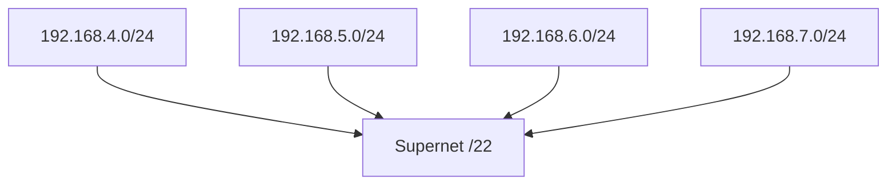
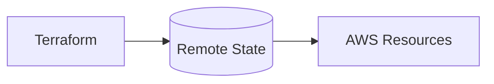
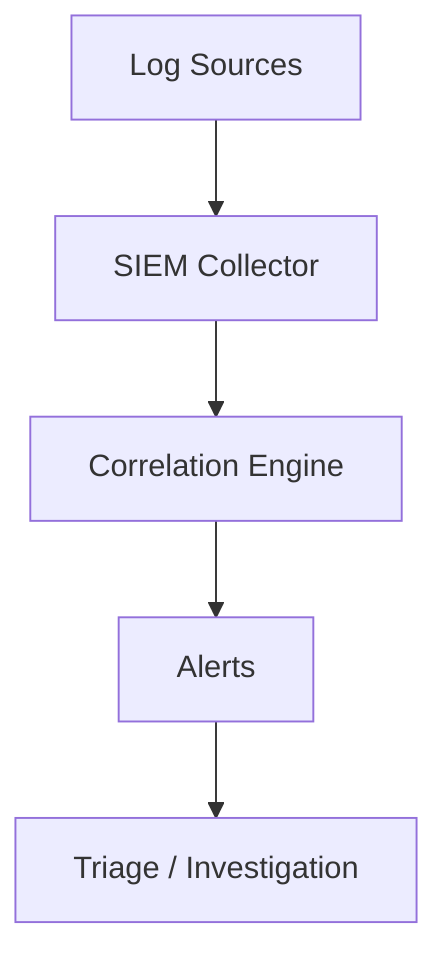

# Day 2 — Advanced Networking + Terraform + SIEM Basics

## Table of Contents
- [Subnetting Deep Dive](#subnetting)
- [CIDR Notation & Supernetting](#cidr)
- [Routing Basics (Static, Dynamic, Route Tables)](#routing)
- [NAT, PAT & Firewall Rules](#nat)
- [Terraform Intermediate Concepts](#terraform)
- [SIEM Concepts for IBM Roles](#siem)
- [Linux Networking Tools — Advanced Usage](#linux)

---

# <a id="subnetting"></a> Subnetting Deep Dive

## Why Subnetting Exists
Subnetting divides a large network into smaller logical networks to improve security, reduce broadcast traffic, and manage IPs efficiently.

## Key Formulas
- **Hosts per Subnet = 2^(32 - subnet mask) - 2**
- **Number of Subnets (Classful) = 2^(borrowed bits)**
- **Block Size = 256 - subnet mask octet**

## Example Problems
### 1) Subnet 192.168.1.0/26
- Mask: 255.255.255.192
- Block size: 64
- Subnets:
  - 192.168.1.0 — 63
  - 192.168.1.64 — 127
  - 192.168.1.128 — 191
  - 192.168.1.192 — 255

### 2) Find the subnet of 10.1.5.27/20
- /20 → Block in 3rd octet: 256 - 16 = 240
- Subnets: 10.1.0.0, 10.1.16.0, 10.1.32.0 ...
- IP 10.1.5.27 is in **10.1.0.0/20**

### 3) How many hosts in /27?
2^(32-27) - 2 = 30 hosts

---

# <a id="cidr"></a> CIDR Notation & Supernetting

CIDR removes class boundaries.

### Examples
- /24 = 256 IPs
- /20 = 4096 IPs
- /16 = 65,536 IPs

## Supernetting Example
Combine 4 networks:
- 192.168.4.0/24
- 192.168.5.0/24
- 192.168.6.0/24
- 192.168.7.0/24

Supernet = **192.168.4.0/22**

### Mermaid Diagram


---

# <a id="routing"></a> Routing Basics (Static, Dynamic, Route Tables)

## What is Routing?
Routing is the selection of a path for traffic to travel across networks.

## Linux Routing Commands
```
ip route show
ip route add 10.1.0.0/24 via 192.168.1.1
ip route del 10.1.0.0/24
```

## Route Table Example
| Destination | Gateway | Interface |
|-------------|---------|-----------|
| 0.0.0.0/0   | 192.168.1.1 | eth0 |
| 10.0.0.0/24 | 0.0.0.0 | eth1 |

---

# <a id="nat"></a> NAT, PAT & Firewall Rules

## NAT Types
- **Static NAT** → One-to-one mapping
- **Dynamic NAT** → Many-to-many pool mapping
- **PAT (NAT Overload)** → Many-to-one using ports (Most common)

## When to Use NAT
- Private → Public IP translation
- Cloud VPC routing
- Firewall traffic control

### Firewall Rule Example
Allow inbound TCP 22 from 10.1.0.0/16:
```
iptables -A INPUT -p tcp -s 10.1.0.0/16 --dport 22 -j ACCEPT
```

---

# <a id="terraform"></a> Terraform Intermediate Concepts

## Providers & Resources
Terraform operates through **providers** (AWS, Google, Cisco, Cloudflare, etc.)

### Example Structure
```
provider "aws" {
  region = "ap-south-1"
}

resource "aws_vpc" "main" {
  cidr_block = "10.0.0.0/16"
}
```

## Terraform State
- tfstate tracks real-world resources
- Remote backends recommended (S3 + DynamoDB locking)

### Diagram


## Variables & Outputs
```
variable "instance_type" {
  default = "t2.micro"
}

output "public_ip" {
  value = aws_instance.web.public_ip
}
```

---

# <a id="siem"></a> SIEM Concepts for IBM Roles

## What is SIEM?
Security Information and Event Management collects, correlates and alerts on security logs.

### Core Functions
- Log collection
- Correlation rules
- Alerts & triage
- Dashboards
- Threat detection

## Common Tools
- **Splunk**
- **QRadar**
- **ELK Stack**
- **ArcSight**

## Basic SIEM Workflow


---

# <a id="linux"></a> Linux Networking Tools — Advanced Usage

## tcpdump
```
tcpdump -i eth0 host 10.0.0.5
```

## nmap Advanced Scans
```
nmap -sS -p 1-1000 192.168.1.10
nmap -A 10.0.0.0/24
```

## nslookup / dig
```
dig google.com ANY
dig @8.8.8.8 example.com
```

## iptables basics
```
iptables -L -v -n
iptables -A INPUT -p icmp -j ACCEPT
```

