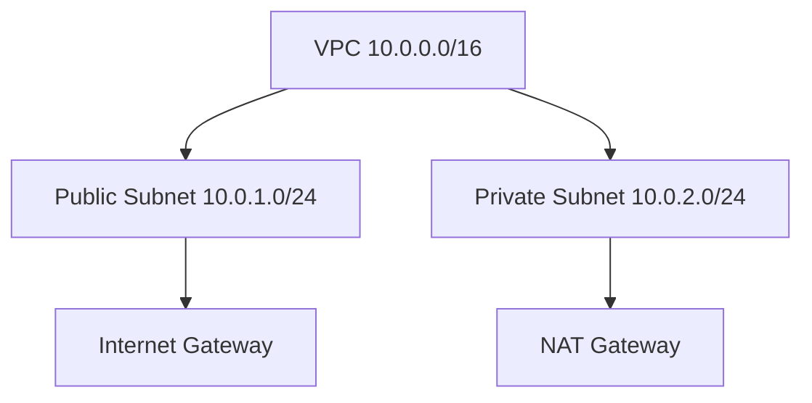
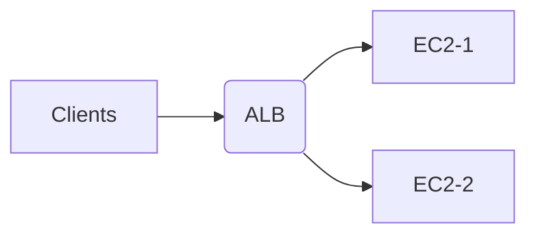

# Day 3 — AWS Core Services (VPC, EC2, IAM, S3, SG, Load Balancers)

## Table of Contents
- [AWS VPC Deep Dive](#vpc)
- [Subnets & Route Tables](#subnets)
- [Internet Gateway, NAT Gateway](#igw)
- [EC2 Architecture & Networking](#ec2)
- [Security Groups vs NACL](#sg_nacl)
- [IAM Complete Notes](#iam)
- [S3 Concepts & Security](#s3)
- [Load Balancers (ALB, NLB)](#elb)
- [Hands-on CLI Commands](#cli)

---

# <a id="vpc"></a> AWS VPC Deep Dive

A **VPC (Virtual Private Cloud)** is your isolated network inside AWS.

### Default VPC Characteristics
- /16 CIDR (example: 172.31.0.0/16)
- Internet Gateway attached
- Public subnets only
- Default route tables

### Custom VPC Example
```
10.0.0.0/16
|
|-- Public Subnet: 10.0.1.0/24
|-- Private Subnet: 10.0.2.0/24
```

### Mermaid Diagram


---

# <a id="subnets"></a> Subnets & Route Tables

## Route Table Example
**Public Subnet Route Table**
| Destination | Target |
|-------------|---------|
| 0.0.0.0/0 | igw-12345 |

**Private Subnet Route Table**
| Destination | Target |
|-------------|---------|
| 0.0.0.0/0 | nat-67890 |

---

# <a id="igw"></a> Internet Gateway & NAT Gateway

## Internet Gateway (IGW)
Used for outbound & inbound internet access. Only for **public subnets**.

## NAT Gateway
Allows **private EC2** to access the internet (patching, apt install, updates). No inbound traffic.

### Interview Question
**Why private EC2 needs NAT Gateway?**
- To download updates
- But still remain unreachable from internet

---

# <a id="ec2"></a> EC2 Architecture & Networking

## Instance Types
- **t2.micro / t3.micro** → free tier
- **m5, c5** → compute heavy
- **g4, p3** → GPU

## EC2 Lifecycle
```
Pending → Running → Stopping → Stopped → Terminated
```

## EC2 Network Interface
- Primary ENI attached at launch
- Can add secondary ENIs

## SSH Flow
```
Laptop → Internet → IGW → Public Subnet → EC2
```

---

# <a id="sg_nacl"></a> Security Groups vs NACL

## Security Groups (Stateful)
- Allow rules only
- Return traffic automatically allowed
- Attached to EC2

## NACL (Stateless)
- Allow + Deny rules
- Return traffic must be manually allowed
- Attached to subnets

### SG Example
```
Inbound: TCP 22 from 0.0.0.0/0
Outbound: ALL
```

### NACL Example
```
Inbound: Allow 1024-65535 Ephemeral
Outbound: Allow 22
```

---

# <a id="iam"></a> IAM Complete Notes

## IAM Components
- User → human
- Group → collection of users
- Role → permissions for AWS services
- Policy → JSON document

### IAM Policy Example
```
{
  "Version": "2012-10-17",
  "Statement": [
    {
      "Effect": "Allow",
      "Action": "s3:*",
      "Resource": "*"
    }
  ]
}
```

## MFA
Must enable MFA for securing AWS root account.

---

# <a id="s3"></a> S3 Concepts & Security

## Storage Classes
- Standard
- Intelligent Tiering
- Glacier
- Deep Archive

## S3 Bucket Policies
```
{
  "Effect": "Deny",
  "Principal": "*",
  "Action": "s3:*",
  "Resource": "arn:aws:s3:::mybucket/*",
  "Condition": {
    "Bool": {"aws:SecureTransport": false}
  }
}
```

### S3 Encryption
- SSE-S3
- SSE-KMS

---

# <a id="elb"></a> Load Balancers (ALB, NLB)

## ALB (Application Load Balancer)
- Layer 7
- Routes by path, hostname
- Supports WebSockets

## NLB (Network Load Balancer)
- Layer 4
- High performance
- Millions of requests per second

### Mermaid Diagram


---

# <a id="cli"></a> Hands-on AWS CLI Commands

## Configure AWS
```
aws configure
```

## EC2 Commands
```
aws ec2 describe-instances
aws ec2 stop-instances --instance-ids i-12345
aws ec2 start-instances --instance-ids i-12345
```

## S3 Commands
```
aws s3 mb s3://mybucket123
aws s3 cp file.txt s3://mybucket123
aws s3 ls s3://mybucket123
```
