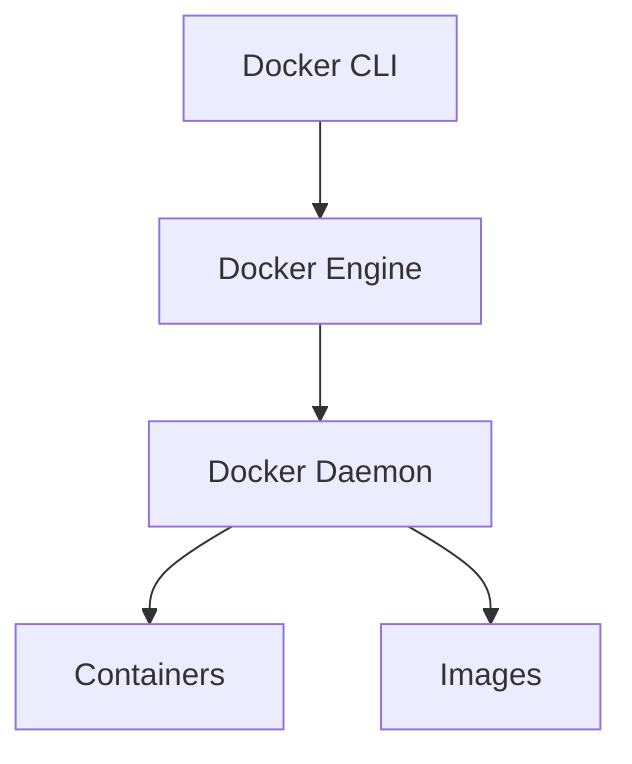
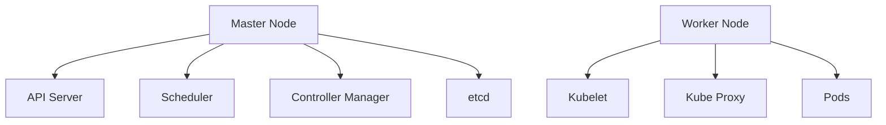

# Day 4 — Docker, Kubernetes, Container Networking & YAML

## Table of Contents
- [Docker Core Concepts](#docker)
- [Docker Images, Containers & Layers](#images)
- [Docker Networking (Bridge, Host, None, Overlay)](#networking)
- [Docker Compose](#compose)
- [Kubernetes Architecture](#k8s_arch)
- [Kubernetes Objects (Pod, Deployment, Service, ConfigMap, Secret)](#k8s_objects)
- [Cluster Networking (CNI, Pod-to-Pod, NodePort, ClusterIP)](#cluster_net)
- [K8s YAML Deep Dive](#yaml)
- [Hands-on Commands](#hands_on)

---

# <a id="docker"></a> Docker Core Concepts
Docker is a platform for building, shipping, and running applications inside lightweight containers.

## Why Docker?
- Portable
- Fast deployment
- Environment consistency
- Lightweight compared to VMs

## Docker Architecture Diagram


---

# <a id="images"></a> Docker Images, Containers & Layers

## Image Structure
- Immutable
- Built in layers
- Stored in registry

### Example Dockerfile
```
FROM ubuntu:20.04
RUN apt update
CMD ["echo", "Hello World"]
```

## Build & Run
```
docker build -t myimage .
docker run myimage
```

---

# <a id="networking"></a> Docker Networking

## Types of Networks
- **bridge** (default)
- **host** (container uses host networking)
- **none** (no network)
- **overlay** (multi-node, used by Swarm/K8s)

### View Networks
```
docker network ls
```

### Create Custom Network
```
docker network create mynet
```

---

# <a id="compose"></a> Docker Compose
Compose helps manage multi-container applications.

### Sample docker-compose.yml
```
version: '3'
services:
  web:
    image: nginx
    ports:
      - "80:80"
  db:
    image: mysql
    environment:
      MYSQL_ROOT_PASSWORD: test123
```

Run:
```
docker-compose up -d
```

---

# <a id="k8s_arch"></a> Kubernetes Architecture



## Key Components
- **API Server** → entry point
- **Scheduler** → assigns pods to nodes
- **Controller Manager** → maintains state
- **etcd** → distributed key-value store
- **Kubelet** → manages pods on worker
- **Kube Proxy** → networking

---

# <a id="k8s_objects"></a> Kubernetes Objects

## Pod
Smallest deployable unit.
```
kubectl get pods
```

## Deployment
Manages replica sets.

### Example YAML
```
apiVersion: apps/v1
kind: Deployment
metadata:
  name: web-deploy
spec:
  replicas: 2
  selector:
    matchLabels:
      app: web
  template:
    metadata:
      labels:
        app: web
    spec:
      containers:
      - name: nginx
        image: nginx:latest
```

## Service
Exposes pods.
- ClusterIP
- NodePort
- LoadBalancer

NodePort YAML:
```
apiVersion: v1
kind: Service
metadata:
  name: web-svc
spec:
  type: NodePort
  selector:
    app: web
  ports:
  - port: 80
    nodePort: 30080
```

## ConfigMap
```
apiVersion: v1
kind: ConfigMap
metadata:
  name: app-config
data:
  MODE: "production"
```

## Secrets
Base64 encoded data.
```
apiVersion: v1
kind: Secret
metadata:
  name: db-pass
stringData:
  password: mysecret123
```

---

# <a id="cluster_net"></a> Cluster Networking

## CNI Plugins
- Flannel
- Calico
- Weave

## Pod-to-Pod Communication
Pods inside a cluster can communicate without NAT.

## Services Routing
- **ClusterIP** for internal
- **NodePort** exposes 30000–32767
- **LoadBalancer** assigns public IP

---

# <a id="yaml"></a> K8s YAML Deep Dive

## Basic Structure
```
apiVersion:
kind:
metadata:
spec:
```

## Common Interview Question
**Why do we use YAML in Kubernetes?**
- Declarative syntax
- Human-readable
- Version control friendly

---

# <a id="hands_on"></a> Hands-on Commands

## Docker
```
docker ps
docker images
docker logs <container>
```

## Kubernetes
```
kubectl get pods -A
kubectl describe pod <name>
kubectl apply -f deployment.yaml
kubectl delete -f deployment.yaml
```

