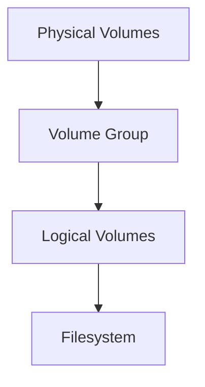

# Day 5 — Linux Deep Dive: Systemd, Logs, Services, Security & Troubleshooting

## Table of Contents
- [Linux Boot Process Deep Dive](#boot)
- [systemd & Service Management](#systemd)
- [Process Management & Signals](#process)
- [Package Management (APT/YUM)](#packages)
- [Logs & Monitoring](#logs)
- [Filesystem, LVM & Permissions](#fs)
- [Linux Networking Troubleshooting](#net)
- [Security Hardening (SSH, Firewall, SELinux/AppArmor)](#security)
- [Interview Troubleshooting Scenarios](#scenarios)

---

# <a id="boot"></a> Linux Boot Process Deep Dive
The Linux boot sequence follows these phases:

```mermaid
graph TD
A[BIOS/UEFI] --> B[Bootloader (GRUB)]
B --> C[Kernel Loads]
C --> D[Initramfs Init]
D --> E[systemd PID1]
E --> F[Targets & Services]
```

### Key Notes
- **BIOS/UEFI** performs hardware checks
- **GRUB** loads kernel + initramfs
- **Kernel** mounts root FS
- **systemd** becomes PID 1
- **Targets** define system states (multi-user, graphical)

Check current target:
```
systemctl get-default
```

---

# <a id="systemd"></a> systemd & Service Management

## Key Commands
```
systemctl status nginx
systemctl start nginx
systemctl stop nginx
systemctl restart nginx
systemctl enable nginx
systemctl disable nginx
```

## Service Unit File Structure
```
[Unit]
Description=My App
After=network.target

[Service]
ExecStart=/usr/bin/python3 app.py
Restart=always

[Install]
WantedBy=multi-user.target
```

Reload systemd:
```
systemctl daemon-reload
```

---

# <a id="process"></a> Process Management & Signals

## View Processes
```
top
htop
ps aux
```

## Kill Signals
- **SIGTERM (15)** → graceful stop
- **SIGKILL (9)** → force stop

Example:
```
kill -9 <pid>
```

---

# <a id="packages"></a> Package Management

## Ubuntu/Debian
```
apt update
apt upgrade
apt install nginx
```

## CentOS/RHEL
```
yum install httpd
dnf update
```

Check repositories:
```
apt-cache search nginx
```

---

# <a id="logs"></a> Logs & Monitoring

## System Logs
```
journalctl -xe
journalctl -u nginx
journalctl --since "2 hours ago"
```

## Log Locations
| Service | Location |
|---------|-----------|
| System Logs | /var/log/syslog |
| Authentication | /var/log/auth.log |
| Cron | /var/log/cron |
| Kernel | /var/log/kern.log |

---

# <a id="fs"></a> Filesystem, LVM & Permissions

## View Disk Usage
```
df -h
du -sh /var/log
```

## Permissions
```
chmod 755 script.sh
chown root:root file
```

## LVM Structure


---

# <a id="net"></a> Linux Networking Troubleshooting

## Interface Info
```
ip a
ip r
```

## DNS Tests
```
dig google.com
nslookup github.com
```

## Packet Capture
```
tcpdump -i eth0 port 443
```

## Restart Network
```
systemctl restart NetworkManager
```

---

# <a id="security"></a> Security Hardening

## SSH Hardening
Edit `/etc/ssh/sshd_config`:
```
PermitRootLogin no
PasswordAuthentication no
```
Restart:
```
systemctl restart sshd
```

## Firewall (ufw)
```
ufw enable
ufw allow 22
ufw allow 80
```

## SELinux
```
getenforce
setenforce 0
```

---

# <a id="scenarios"></a> Interview Troubleshooting Scenarios

### 1) Server is slow — what do you check?
- CPU: `top`
- Memory: `free -h`
- Disk I/O: `iostat`
- Network: `ss -tulnp`

### 2) Website down — how to troubleshoot?
- Check service: `systemctl status nginx`
- Check port: `ss -tulnp | grep 80`
- Check logs: `journalctl -u nginx`
- Check firewall
- Check DNS

### 3) SSH not working
- Security group / firewall
- SSH service running?
- Key permission: `chmod 600 key.pem`
- ICMP to check reachability

### 4) High CPU by a process
```
top
kill -15 <pid>
```

### 5) Disk full
```
du -sh *
rm -rf /var/log/*.gz
```

