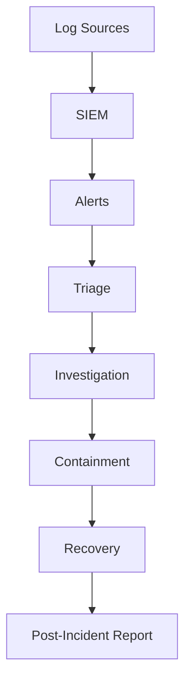
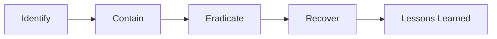
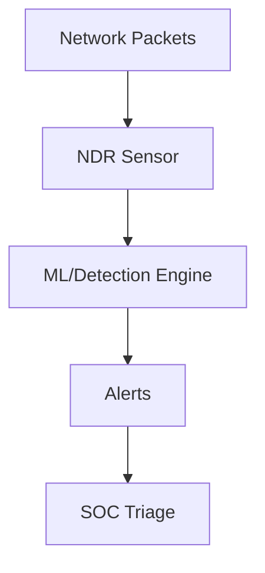

# Day 6 — Security, SOC, SIEM, NDR, WAF & Threat Hunting

## Table of Contents
- [Security Operations Center (SOC) Overview](#soc)
- [SIEM Core Concepts (QRadar, Splunk)](#siem)
- [Log Sources & Event Types](#logs)
- [Correlation Rules & Use Cases](#correlation)
- [Incident Response Lifecycle](#ir)
- [Threat Hunting Framework](#hunt)
- [NDR (Network Detection & Response)](#ndr)
- [WAF (Web Application Firewall) Essentials](#waf)
- [Common Attacks & Detection](#attacks)
- [Practical Commands & Log Analysis](#practical)

---

# <a id="soc"></a> Security Operations Center (SOC) Overview
A SOC monitors, detects, analyzes, and responds to security incidents.

### SOC Levels
- **Tier 1:** Monitoring, triage, initial analysis
- **Tier 2:** Deep investigation, correlation, threat hunting
- **Tier 3:** Forensics, malware reverse engineering

## SOC Workflow


---

# <a id="siem"></a> SIEM Core Concepts (QRadar, Splunk)
SIEM = Security Information & Event Management

## Key Functions
- Collect logs
- Normalize & parse
- Correlate events
- Create alerts
- Dashboards

### Common Fields in Logs
- Source IP
- Destination IP
- Username
- EventID
- Timestamp
- Action (Allow/Deny)

### Example SIEM Query (Splunk)
```
index=firewall action=blocked src_ip=10.0.0.5
```

---

# <a id="logs"></a> Log Sources & Event Types

## 1. Firewall Logs
- Block/Allow
- Ports
- Protocols

## 2. Authentication Logs
Linux example:
```
/var/log/auth.log
```
Failed login:
```
Failed password for user root from 192.168.1.50 port 50022
```

## 3. DNS Logs
- Detect C2 (command-and-control)
- Domain tunneling

## 4. Proxy Logs
- Malicious URLs

## 5. Cloud Logs
- AWS CloudTrail
- Azure AD Sign-in logs

---

# <a id="correlation"></a> Correlation Rules & Use Cases
Correlation = combining events from different sources.

## Sample Use Cases
### 1) Multiple failed logins + successful login
```
IF Failed_Logins > 10 AND Successful_Login THEN Alert "Brute Force Success"
```

### 2) Outbound traffic to blacklisted IP
### 3) Unauthorized root escalation
### 4) Suspicious DNS queries
### 5) Excessive file downloads

---

# <a id="ir"></a> Incident Response Lifecycle



### Steps
1. Identify incident
2. Isolate the system
3. Remove malware or threat
4. Restore services
5. Document findings

---

# <a id="hunt"></a> Threat Hunting Framework
Threat hunting = proactive search for threats that evade detection.

## Steps
- Form hypothesis
- Collect data
- Hunt using logs & patterns
- Validate findings
- Document and refine

### Example Hypothesis
"There may be lateral movement using SMB on port 445."

Run logs for:
- SMB connections
- New admin accounts
- Anomalous login times

---

# <a id="ndr"></a> NDR (Network Detection & Response)
NDR analyzes network traffic for anomalies.

## Tools
- Darktrace
- Vectra
- ExtraHop
- Corelight

## NDR Workflow


### Key Skills
- PCAP analysis
- Understanding protocols: TCP/IP, HTTP, TLS
- Detecting anomalies

---

# <a id="waf"></a> WAF (Web Application Firewall) Essentials
WAF protects web apps from:
- SQL Injection
- XSS
- CSRF
- Path Traversal

### WAF Rule Example
Block SQL injection pattern:
```
SELECT * FROM
```

---

# <a id="attacks"></a> Common Attacks & Detection

## 1. Brute Force Attack
Log shows repeated failures.
```
Failed password for ubuntu from 10.0.0.15
```

## 2. DDoS
- Huge traffic from multiple IPs

## 3. Port Scanning (Nmap)
Look for:
- Many connection attempts on multiple ports

## 4. Malware Beaconing
- Repeated outbound DNS queries

## 5. Data Exfiltration
- Large outbound traffic to unknown IP

---

# <a id="practical"></a> Practical Commands & Log Analysis

## Linux Security Logs
```
tail -f /var/log/auth.log
journalctl -u sshd
```

## Network Analysis Basics
```
tcpdump -i eth0 port 443
```

## Detect Port Scan with tcpdump
```
tcpdump -n "tcp[tcpflags] & (tcp-syn) != 0"
```

## Firewall Allow/Deny Logs (Example)
```
DPT=22 SRC=192.168.1.10 DROP
```

---