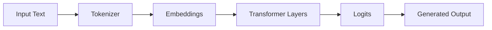
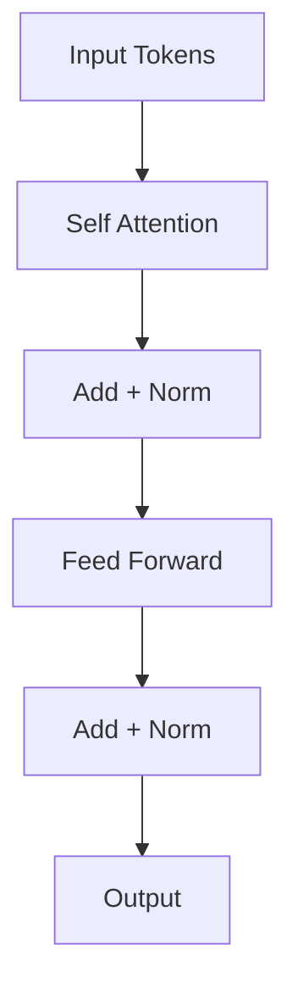
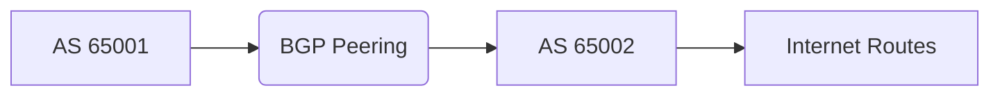
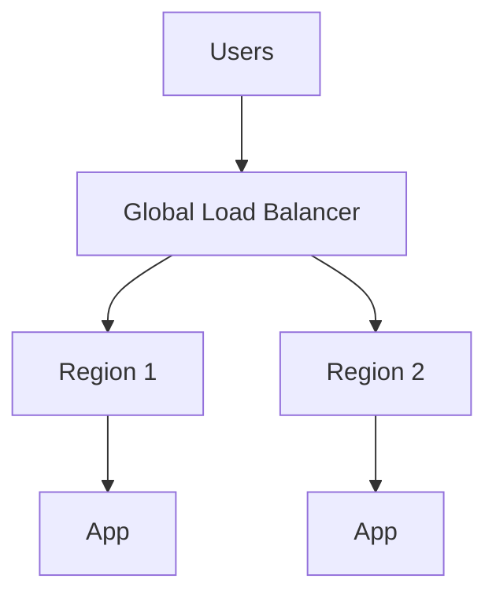

# Day 9 — Ultra-Advanced Topics (LLM, Transformers, Network Security Deep, BGP, Zero Trust, Cloud Architecture)

## Table of Contents
- [Large Language Models (LLMs) — Foundation](#llm)
- [Transformers Architecture Deep Dive](#transformers)
- [Attention Mechanism (Self-Attention Maths)](#attention)
- [BGP (Border Gateway Protocol) — Advanced Networking](#bgp)
- [Zero Trust Architecture](#zero_trust)
- [Advanced Cloud Architecture Patterns](#cloud)
- [Distributed Systems Concepts](#distributed)
- [Advanced Security Concepts (ZTNA, SDP, SASE)](#adv_security)

---

#  Large Language Models (LLMs) — Foundation
LLMs are deep neural networks trained on massive text corpora to predict the next token.

## Key Concepts
- Tokens = smallest text units
- Context Window = how much information the model can consider
- Embeddings = vector representation of meaning
- Pretraining = predict missing/next tokens
- Finetuning = specialize model
- RLHF = Reinforcement Learning from Human Feedback

## Mermaid Diagram: LLM Flow

---

#  Transformers Architecture Deep Dive

Transformers use **self-attention** instead of recurrence.

## Components
- Multi-Head Attention
- Feed Forward Networks
- LayerNorm
- Positional Encoding

---

#  Attention Mechanism (Self-Attention Maths)
Self-attention uses Queries, Keys, Values.

### Formula
Attention(Q, K, V) = softmax((Q · K^T) / √d_k) · V

### Explanation
- Q matches "what I'm looking for"
- K is "what each token contains"
- V is the content returned

---

#  BGP (Border Gateway Protocol) — Advanced Networking
BGP is the protocol that routes the internet.

## Key Concepts
- Path Vector Protocol
- ASN (Autonomous System Number)
- eBGP vs iBGP
- Route Advertisements
- Next-Hop Attributes
- BGP Peering

### BGP Path Selection
1. Highest Local Preference
2. Shortest AS Path
3. Lowest Origin Type
4. Lowest MED
5. Prefer eBGP over iBGP
6. Lowest Router ID

### Mermaid Diagram

---

#  Zero Trust Architecture
Zero Trust = "Never trust, always verify."

## Principles
- Verify identity continuously
- Least privilege access
- Micro-segmentation
- No implicit trust based on network location

## Components
- ZTNA
- MFA + SSO
- Identity providers (IdP)
- Continuous monitoring

---

#  Advanced Cloud Architecture Patterns

## 1. Microservices
- Independent deployment
- API gateway

## 2. Event-driven architecture
- SNS, SQS, Kafka

## 3. Service Mesh (Istio/Linkerd)
- Traffic control
- mTLS
- Observability

## 4. Multi-Region Failover
- Active-active
- Active-passive

## 5. High Availability Pattern
- ELB + ASG + Multi-AZ RDS

---

#  Distributed Systems Concepts

## CAP Theorem
- Consistency
- Availability
- Partition Tolerance

You can only pick **two** during failures.

## Consensus Algorithms
- Raft
- Paxos

## Data Partitioning
- Sharding
- Replication

---

#  Advanced Security Concepts (ZTNA, SDP, SASE)

## ZTNA (Zero Trust Network Access)
- Requires identity-based access
- No broad VPN tunnel

## SDP (Software-Defined Perimeter)
- Hides infrastructure
- Connects only after authentication

## SASE (Secure Access Service Edge)
- Combines WAN + Security
- ZTNA + CASB + FWaaS + DLP

---
