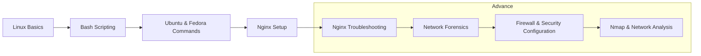
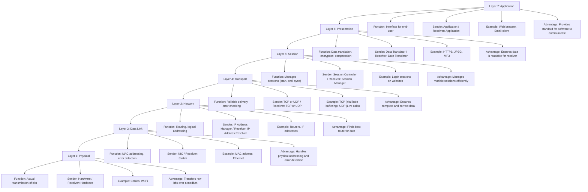

# 🧭 **Linux & Nginx — Master Notes Index (Beginner → Advanced)**

| Level               | Category                              | Topic / Description                                                                                                                     | Link                                                                                                                                                                             |
| :------------------ | :------------------------------------ | :-------------------------------------------------------------------------------------------------------------------------------------- | :------------------------------------------------------------------------------------------------------------------------------------------------------------------------------- |
| 🟢 **Beginner**     | **Linux Basics**                      | 🔹 **Linux File Permissions** – Explanation of `rwx`, `chmod`, `chown`, `umask`, symbolic and numeric modes with examples and diagrams. | [View Notes](https://github.com/akashdip2001/linux-all-commands/blob/main/00%20Linux%20File%20Permission.md)                                                                     |
| 🟢 **Beginner**     | **Shell Scripting**                   | 🔹 **Bash Scripting Basics** – Variables, loops, conditionals, functions, I/O redirection, and automation fundamentals.                 | [View Notes](https://github.com/akashdip2001/linux-all-commands/blob/main/01%20Bash%20Scripting.md)                                                                              |
| 🟢 **Beginner**     | **Linux Commands Collection**         | 🔹 **Kali Linux All Commands** – Essential Kali commands for penetration testing, system checks, and network tools.                     | [View Notes](https://akashdip2001.github.io/kali-all-commands/#my-website-https-akashdip2001-github-io-linktree)                                                                 |
| | | 🔹 Ubuntu Commands Reference | [View](https://akashdip2001.github.io/ubuntu-all-commaands/) |
| | | 🔹 Fedora Commands Reference | [View](https://akashdip2001.github.io/fedora-all-imp-commands/) |
| 🟡 **Intermediate** | **Web Server Setup**                  | 🔹 **Nginx Setup & Configuration** – Step-by-step guide for installing and configuring Nginx, directory structure, and virtual hosts.   | [View Notes](https://github.com/akashdip2001/Nginx-Comprehensive-Notes-Troubleshooting-Configs-Diagrams-Scripts/blob/main/00%20setup%20Nginx.md)                                 |
| 🟠 **Advanced**     | **Network Troubleshooting**           | 🔹 **Nginx Troubleshooting Guide** – Diagnosing connection issues, DNS, reverse proxy problems, and HTTP response code analysis.        | [View Notes](https://github.com/akashdip2001/Nginx-Comprehensive-Notes-Troubleshooting-Configs-Diagrams-Scripts/blob/main/01%20Nginx%20Troubleshooting.md)                       |
| 🟠 **Advanced**     | **Network Forensics**                 | 🔹 **Network Forensics & Packet Analysis** – Using tools like Wireshark, tcpdump, and analyzing ICMP, HTTP, and TCP behavior.           | [View Notes](https://github.com/akashdip2001/Nginx-Comprehensive-Notes-Troubleshooting-Configs-Diagrams-Scripts/blob/main/02%20Network%20Forensics%20%26%20Packet%20Analysis.md) |
| 🔴 **Expert**       | **Nmap & Security Analysis**          | 🔹 **IP Not Found in Nmap** – Steps to troubleshoot unreachable IPs, ICMP filters, firewall rules, routing, and port scans.             | [View Notes](https://github.com/akashdip2001/Nginx-Comprehensive-Notes-Troubleshooting-Configs-Diagrams-Scripts/blob/main/03%20IP%20not%20found%20nMap.md)                       |
| 🔴 **Expert**       | **Firewall & Security Configuration** | 🔹 **Allow Firewall Rules for Nginx** – Configure UFW, firewalld, iptables to allow ports and IP-specific access in Linux or cloud.     | [View Notes](https://github.com/akashdip2001/Nginx-Comprehensive-Notes-Troubleshooting-Configs-Diagrams-Scripts/blob/main/04%20allow%20Firewall.md)                              |

---

### 🧩 **Progress Flow (Mermaid Diagram)**

 
 

---

# Computer-Network-OSI

The **OSI Model (Open Systems Interconnection Model)** is a **conceptual framework** that standardizes the functions of a telecommunication or computing system into **seven distinct layers**. Each layer performs a specific role and communicates with the layers directly above and below it.

---

### **7 Layers of OSI Model**

| Layer | Name             | Function                                  | Sender Type        | Receiver Type       | Real-Life Example                         | Advantage                                     |
| ----- | ---------------- | ----------------------------------------- | ------------------ | ------------------- | ----------------------------------------- | --------------------------------------------- |
| 7     | **Application**  | Interface for end-user                    | Application        | Application         | Web browser, Email client                 | Provides standard for software to communicate |
| 6     | **Presentation** | Data translation, encryption, compression | Data Translator    | Data Translator     | Encryption (HTTPS), JPEG, MP3             | Ensures data is readable for receiver         |
| 5     | **Session**      | Manages sessions (start, end, sync)       | Session Controller | Session Manager     | Login session on websites                 | Manages multiple sessions efficiently         |
| 4     | **Transport**    | Reliable delivery, error checking         | TCP/UDP            | TCP/UDP             | TCP (YouTube buffering), UDP (Live calls) | Ensures complete and correct data             |
| 3     | **Network**      | Routing, logical addressing               | IP Address Manager | IP Address Resolver | Routers, IP addresses                     | Finds best route for data                     |
| 2     | **Data Link**    | MAC addressing, error detection           | NIC                | Switch              | MAC address, Ethernet                     | Handles physical addressing, error detection  |
| 1     | **Physical**     | Actual transmission of bits               | Hardware           | Hardware            | Cables, Wi-Fi                             | Transfers raw bits over a medium              |

---

## **Practical Explanation: Real-Life Example – Accessing Google.com from a browser**

Imagine you open a browser and type **[www.google.com](http://www.google.com)** and hit enter:

---

### **Layer-wise Operation**

1. **Application Layer (Layer 7)**

   * Your **browser (Chrome, Firefox)** initiates the request.
   * User interacts here (e.g., sending HTTP requests).
   * **Sender**: Application (Browser), **Receiver**: Web Server (Google).
   * **Advantage**: Standardizes communication between applications.

2. **Presentation Layer (Layer 6)**

   * Translates data into a format both ends can understand.
   * If you’re sending data securely, it handles **SSL/TLS encryption**.
   * **Example**: Converts HTTP to HTTPS using encryption.
   * **Advantage**: Ensures security and compatibility of data.

3. **Session Layer (Layer 5)**

   * Establishes a session with **Google’s servers**.
   * Maintains the session till you're using the website.
   * Handles disconnection and reconnection.
   * **Advantage**: Enables multiple sessions (e.g., multiple tabs open).

4. **Transport Layer (Layer 4)**

   * Splits data into **segments**, adds **port numbers**.
   * Chooses between TCP (reliable) or UDP (fast).
   * **Sender**: Source port (e.g., 49152), **Receiver**: Port 443 (HTTPS).
   * **Advantage**: Ensures reliable data delivery and retransmission.

5. **Network Layer (Layer 3)**

   * Adds **IP addresses**, chooses best route.
   * Your IP (source), Google’s IP (destination).
   * Routers work here.
   * **Advantage**: Data reaches the correct device, even across networks.

6. **Data Link Layer (Layer 2)**

   * Adds **MAC address** for next-hop device.
   * Ensures **error-free delivery** to the next switch/router.
   * Ethernet or Wi-Fi protocols.
   * **Advantage**: Error detection, frame synchronization.

7. **Physical Layer (Layer 1)**

   * Transmits bits (0s and 1s) over cables or air (Wi-Fi).
   * Involves **modems, cables, signals**.
   * **Advantage**: Hardware implementation of transmission.

---

## **Sender Type vs Receiver Type in Each Layer**

| Layer | Sender Type         | Receiver Type       |
| ----- | ------------------- | ------------------- |
| 7     | User app (browser)  | Server app (Google) |
| 6     | Encryption software | Decryption software |
| 5     | Session initiator   | Session responder   |
| 4     | TCP/UDP module      | TCP/UDP module      |
| 3     | IP sender           | IP receiver         |
| 2     | NIC with MAC        | NIC with MAC        |
| 1     | Cable/antenna       | Cable/antenna       |

---

### **Why It Matters in Interviews**

**Interviewers often test:**

* Whether you understand **which layer does what**
* Your grasp of **real-world examples**
* Whether you can **troubleshoot**: "What happens if DNS fails?" (Layer 7), "What if there's no IP?" (Layer 3)

---

### **Common Interview Questions:**

1. **What is the role of the transport layer?**

   * Ensures end-to-end data delivery, reliability (TCP), or speed (UDP).

2. **Where does encryption happen in OSI?**

   * Presentation Layer (Layer 6).

3. **What if my Wi-Fi isn’t working?**

   * Could be a Physical (Layer 1) or Data Link (Layer 2) issue.

4. **What’s the difference between TCP and UDP?**

   * TCP is reliable and slower (e.g., file downloads); UDP is fast and unreliable (e.g., online games, Zoom).

---
